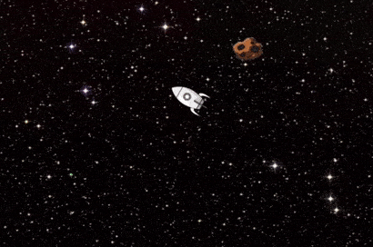

# AsteroidField-Game
AsteroidField is a game based on HTML5 canvas.

## Main Features

### Player-spaceship
- Starts in the middle of the screen/canvas
- Rotates sideways, pressing right and left arrow keys
- Accelerates pressing up arrow key
- To decelerate, turn ship around and press up arrow key
- Gets off viewport and re-enters at the exact opposite point
- Player wins by duration of game before collision with an asteroid
- Score records are kept

### Asteroids
- Appear from random point of the 4 borders, taking a random direction.
- Number of asteroids on viewport increases with time
- Speed of asteroids also increases with time
